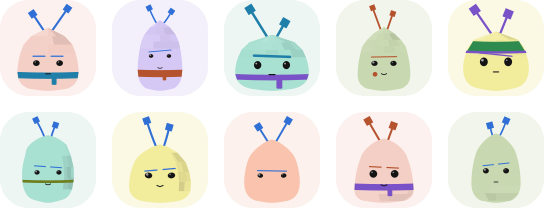

<div align="center">



# Nurblings

**Any string in, a small curious creature out.**<br>
Deterministic SVG avatars for React, Next.js, Vue, Nuxt, Astro and plain JavaScript.

[](https://www.npmjs.com/package/nurblings)
[](https://bundlejs.com/?q=nurblings)
[](packages/nurblings/src/index.ts)
[](https://github.com/albertesparragoza/nurblings/actions/workflows/ci.yml)
[](LICENSE)
[](https://creativecommons.org/publicdomain/zero/1.0/)

[Getting started](docs/getting-started.md) · [Motion](docs/motion.md) · [Customising](docs/customising.md) · [API](docs/api.md) · [Contributing](CONTRIBUTING.md)

</div>

The same string always hatches the same Nurbling. Every one is a relative of
**Nurbi**, a character whose two antennae are bezier control handles: the tools
that turn an intention into a curve. Your handle becomes its handles.

> [!NOTE]
> Pre-release. The API is settled and the first version is on its way to npm.

## Install

| Framework | Package | Install |
| --- | --- | --- |
| Next.js, React | [`@nurblings/react`](packages/react) | `npm install @nurblings/react` |
| Nuxt, Vue | [`@nurblings/vue`](packages/vue) | `npm install @nurblings/vue` |
| Astro | [`@nurblings/astro`](packages/astro) | `npm install @nurblings/astro` |
| Any HTML, Svelte, Angular | [`@nurblings/element`](packages/element) | `npm install @nurblings/element` |
| Plain JavaScript | [`nurblings`](packages/nurblings) | `npm install nurblings` |

What works where, from server rendering to themes, dark mode, motion and
transitions: see the [feature table](docs/getting-started.md#what-each-package-supports).

## Quick start

```tsx
// React and Next.js: a server component, no client JavaScript
import { Nurbling } from '@nurblings/react'

<Nurbling seed={user.email} size={48} title={user.name} />
```

```vue
<!-- Vue and Nuxt -->
<script setup>
import { Nurbling } from '@nurblings/vue'
</script>

<template>
  <Nurbling :seed="user.email" :size="48" :title="user.name" />
</template>
```

```astro
---
// Astro: static SVG, zero client JavaScript
import { Nurbling } from '@nurblings/astro'
---

<Nurbling seed="ada@example.com" size={48} background="circle" />
```

```html
<!-- Anywhere HTML goes: a custom element (or import '@nurblings/element/define' with a bundler) -->
<script type="module" src="https://cdn.jsdelivr.net/npm/@nurblings/element/dist/define.js/+esm"></script>
<nurbling-avatar seed="ada@example.com" size="48"></nurbling-avatar>
```

```ts
// Plain JavaScript: an SVG string, or a data URI for 
import { nurbling, nurblingSrc } from 'nurblings'

element.innerHTML = nurbling('ada@example.com', { size: 48 })
image.src = nurblingSrc('ada@example.com')
```

Framework guides are in [getting started](docs/getting-started.md); every
option is in the [API reference](docs/api.md).

## Use it with your coding agent

```sh
npx skills add albertesparragoza/nurblings
```

The [Nurblings skill](skills/nurblings/SKILL.md) teaches Claude Code, Cursor,
Codex and other agents the library, so "give every commenter an avatar" comes
back with the right package, stable-id seeds and accessible names.

## Why Nurblings

- **Deterministic.** A username, email or ID hashes to a fixed set of traits.
  No storage, no uploads, no network, no randomness at render time.
- **Stable across releases.** Traits ship in numbered generations, and golden
  fixtures in CI hold every avatar byte for byte within one.
- **A family, not a template.** Ten body designs, plates on the crown, a flank,
  the base or nowhere, one or two antennae, eyes, brows, moods, extras and
  paired colours. A few fixed rules keep each one recognisably a Nurbling, even
  at 24 pixels.
- **Alive.** Every Nurbling breathes, blinks and sways its antennae, with CSS
  alone. Turn it off with `animate: false`, or keep only the layers you want.
- **Moves between places.** Give an avatar the same `transition` key in a
  dialog and a list, wrap the change in `morph()`, and it glides from one to
  the other: native View Transitions, or a sharp vector FLIP animation.
- **Server first.** The React and Astro components ship no JavaScript. The
  output is one SVG with no ids, so any number of avatars can share a page.
- **Accessible.** Every avatar has an accessible name, colours are paired for
  contrast on light and dark pages, and all motion stops for anyone who asks
  for reduced motion.
- **Themes and dark mode.** Ten built-in themes by name, any 2 to 5 brand
  colours through `palette()`, and `mode="auto"` for light and dark pages with
  CSS alone.
- **Small.** The core is under 9 KB compressed with no dependencies; each
  framework component adds well under 1 KB. Size limits run in CI.

## Make it yours

Pick a built-in theme by name, or turn your brand colours into one:

```tsx
<Nurbling seed={user.id} title={user.name} theme="lagoon" mode="auto" />
```

```ts
import { createNurblings } from 'nurblings'
import { palette } from 'nurblings/themes'

export const avatars = createNurblings({ theme: palette(['#264653', '#e9c46a', '#f4a261']) })
```

`createNurblings` also takes your own body designs, drawn parts and defaults.
React has a `NurblingsProvider`, Vue a `NurblingsPlugin`; see
[customising](docs/customising.md).

## Repository

| Path | What |
| --- | --- |
| [`packages/nurblings`](packages/nurblings) | Core: seed hashing, traits, SVG renderer |
| [`packages/react`](packages/react), [`vue`](packages/vue), [`astro`](packages/astro) | Framework components |
| [`examples/`](examples) | Next.js, Nuxt and Astro apps, built in CI |
| [`docs/`](docs) | Guides and API reference |

```sh
pnpm install
pnpm build && pnpm test
```

Node 22.13 or newer and pnpm 11. Details in [CONTRIBUTING.md](CONTRIBUTING.md).

## Contributing

Issues and pull requests are welcome. Start with
[CONTRIBUTING.md](CONTRIBUTING.md); new traits begin as a trait proposal issue,
because a trait added to a released generation would change existing avatars.

## Credits

Inspired by [blobatar](https://github.com/Alain00/blobatar), which showed how
far a deterministic avatar can go.

## License

- Code: [MIT](LICENSE).
- Generated avatars: public domain under
  [CC0 1.0](https://creativecommons.org/publicdomain/zero/1.0/). Use them
  anywhere, no attribution needed.
- The names Nurbi and Nurblings and the flagship artwork are reserved; see
  [TRADEMARKS.md](TRADEMARKS.md).
